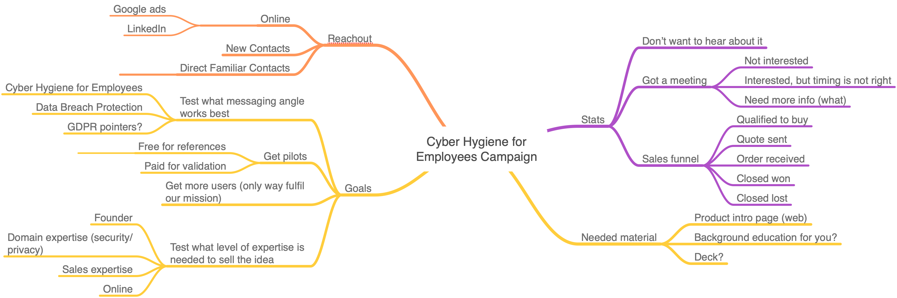

# 2019-01-31 - Trial marketing kickoff

  * [ ] Introt: Eija, Hannu, Markus
  * [ ] Overview, by using Jani's mindmap
  * [ ] Brief company presentation (quickly to see if there is something you want to
    use)
  * [ ] badrap.io demo with some actual warnings.
    * [Few relevant slides](https://about.badrap.io/tech/#/9)
    * https://docs.badrap.io/
  * [ ] Product Landing page [existing material](https://deploy-preview-56--jovial-morse-ab420e.netlify.com/companies/employees)
  * [ ] Set up hubspot accounts (Settings->Users & Teams)
    * [ ] Map progress/prospects in Hubspot
  * [ ] Make sure access rights are there
  * [ ] Get familiar with Google hangouts for potential screen sharing sessions
  * [ ] Map potential prospects and talk how this would help them. Idea about
    the employee numbers?

## Questions & Homework for Jani

