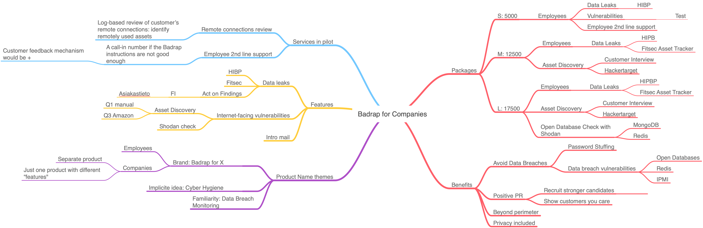

# Employee Cybrer Hygiene Campaign

## Timeline

* 2019-01-22 First sparring session with Teemu@Tecinspire: Badrap intro and
  experiences from the pre-trial marketing.
* 2019-01-25 Second sparring session. Sales material, [Cyber Hygiene intro page]
  as the main focus.

Upcoming:

* 2019-01-20 Round three with Teemu
* 2019-01-31 [Kickoff with trial marketeers](2019-01-31-kickoff.md)

## Prospecting

* Try to have as much of the material openly available here (not customer
  related stuff though)
* Hubspot for tracking progress and feedback

### Online messaging test

Test with social media badges, which angle works the best?

* Protect Employees >> Protect your company >> Protect your business,
* Prevent Data Breaches, or
* Employee Cyber Hygiene

### Leveraging existing networks

We have qualified three contractors for reaching out and getting feedback:

* N.N. with substance expertise, GDPR background and knows well the issues
  related to data leaks
* N.N. with healtcare contacts and prior experience on trial marketing
* N.N. a powerhorse with vast networks and sales expertise

### Landing page

* [x] Separate domain for the product? Not right now, trying to keep different
    brands in check.
* Also looked forward a bit and considered the product naming model.
  * Cyber Hygiene for Employees - a tad long. Alternatives:
  * Badrap + angle -> Badrap Employees. Badrap Cloud
* [ ]Landing page starts with protect employees = protect business
* Security pro's picked up the PR angle in pre-trial marketing. Remember to
  include PR & HR values

Structure:

* [ ] Start is good, with minor facelift employee->company->business
* [ ] Main benefits next, less text, more gfx
* [ ] "How does it work" has benefits but also mixes in features.
  * [ ] Reduce marketing words
* [ ] Why work with us
* [ ] Here goes public acknowledgements when you have them (at the latest)
* [ ] Your story (remind your "security information for all vision)
* [ ] Video to demonstrate how **easy** this is

### Prospects

* Get the first pilot
* [ ] Study Tecinspire offer for more pleasant offers

### Pilots

* Public testimonials needed. Make example so that prospects understand well
  this is good PR as well.
  * *These companies take care of their employees*
