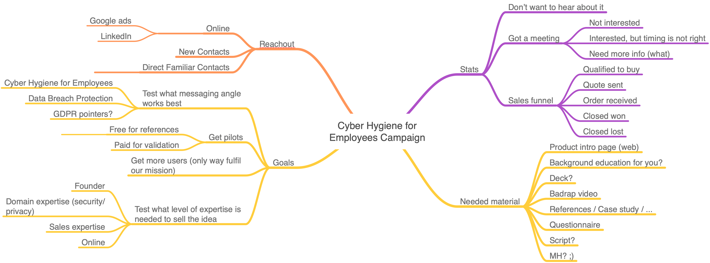

# Cyber Hygiene for Employees

## Team

* [Jani Kenttälä](https://www.linkedin.com/in/janikenttala/), Badrap CEO, founder
* [Teemu Kivioja](https://www.linkedin.com/in/teemukivioja/) - Product and messaging wizard with 100% customer satisfaction.
* [Markus Itkonen](https://www.linkedin.com/in/markus-itkonen-85ba5010/) -
  startup productisation and marketing trials and sales with healtcare sector background.
* [Eija Hämäläinen](https://www.linkedin.com/in/hamalaineneija/) - sales and marketing powerhorse with vast networks and sales expertise
* [Hannu Hietala](https://www.linkedin.com/in/hannu-hietala-0b76161/) -
  GDPR/privacy guru

## Timeline

2019-01 Prepare, 2019-02 Reachout sprint I, 2019-03 Reachout sprint II.

* 2019-01-22 First sparring session with Teemu. Badrap intro and
  experiences from the pre-trial marketing.
* 2019-01-25 Second sparring session. Sales material,
  [Cyber Hygiene for Employees intro page](https://about.badrap.io/employees)
  as the main focus.
* 2019-01-31 [Kickoff with trial marketeers](notes/2019-01-31-kickoff.md) - recapped
  what Badrap is about, arranged Hubspot access and envisioned first target customers.
* 2019-02-06 [Employee Cyber Hygiene Updates](https://about.badrap.io/employees),
  [Explainer video
  tests](https://www.youtube.com/playlist?list=PLOg26p9j1bIux5wvlMJ1bYFI_5PhrNjtt),
  and [social media gitbadges](badges.md)
* 2019-02-08 [Trial marketing sparring](notes/2019-02-08-sparring.md) with Teemu @ Tecinspire.
* 2019-02-15 [Social media reachout](notes/2019-02-15-social-media.md) with Teemu @
  Tecinspire

## Plan

[Plan](plan.md)

## Assets

* Banner Photo by [Annie Spratt on Unsplash](https://unsplash.com/photos/g9KFpAfQ5bc?utm_source=unsplash&utm_medium=referral&utm_content=creditCopyText)
more h

## Links

* [Employees Landing Page](https://about.badrap.io/employees/)
* [Hubspot](https://www.hubspot.com/)
